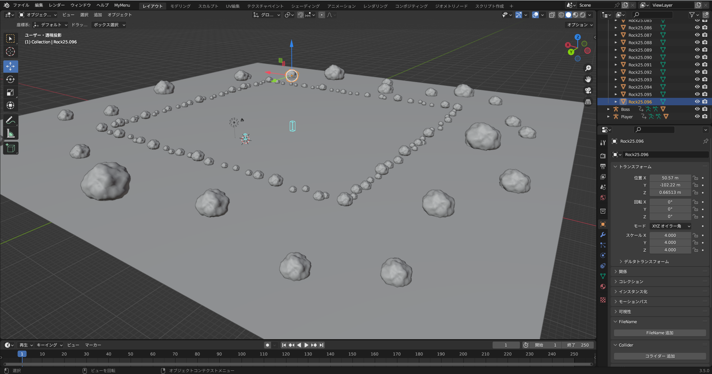
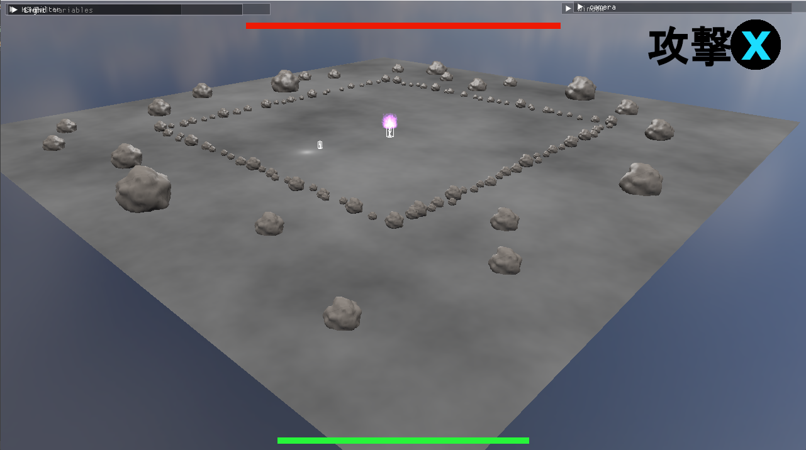

# 個人制作

## タイトル 「魔法師の戦い」

[動画](https://youtu.be/O24rCQqD6VE)

### ゲームの概要

 - ゲームジャンル
   - 3Dアクションシューティング
 - 制作人数
   - 1人
 - 製作期間
   - 2024年03月~
 - 開発環境
   - DirectX12

## ステージ配置
Blender上で作成したステージオブジェクトの配置情報をPythonで作成した自作のアドオン機能を使ってjsonファイルで出力。それをゲーム側で読み込むことで簡単に配置できるようになっています。

### Blender側

### ゲーム側

## パーティクルシステムと攻撃エフェクト

### パーティクル
パーティクルは大量に描画するので、Compute Shaderを利用して生成や更新処理を効率化して、パフォーマンスを最適化しています。パーティクルの設定では、生成数や速さ、大きさなどのパラメーターに加え、時間経過で速度や色などの値を変化させるためのパラメーターがあります。

[エディター動画](https://youtu.be/gjEv2UMkZUs)

### 作成した攻撃

# DaiEngine
DirectX12を利用して作成した、自作ゲームエンジン。3Dゲーム制作における基礎的な機能が実装されています。

## Engine機能
### [[Engine](https://github.com/daiya-04/DirectXGame/tree/master/DirectXGame/Engine)]
 - [2d](https://github.com/daiya-04/DirectXGame/tree/master/DirectXGame/Engine/2d)
   - Spriteの描画。主にUIや背景に使用する。
 - [3d](https://github.com/daiya-04/DirectXGame/tree/master/DirectXGame/Engine/3d)
   - ライト（平行光源、点光源、スポットライト）。
   - Assimpを用いたobj、gltfファイルの読み込み。
   - モデルの描画。
   - アニメーションデータの読み込みと再生。
   - スキニング機能。
   - パーティクルシステム。
 - [Audio](https://github.com/daiya-04/DirectXGame/tree/master/DirectXGame/Engine/Audio)
   - Media Foundationを用いたwavファイルとmp3ファイルの読み込み。
   - XAudio2を用いた音の再生と停止、音量/ピッチの調整。
 - [Input](https://github.com/daiya-04/DirectXGame/tree/master/DirectXGame/Engine/Input)
   - DInput,Xinputを用いた、キーボード、Xboxコントローラーの入力。
 - [Loader](https://github.com/daiya-04/DirectXGame/tree/master/DirectXGame/Engine/Loader)
   - Blenderから出力したレベルデータ(jsonファイル)の読み込み。
 - [Line](https://github.com/daiya-04/DirectXGame/tree/master/DirectXGame/Engine/Line)
   - 線の描画。主に衝突判定の可視化で使用する。

## 使用している外部ライブラリ
### [[externals](https://github.com/daiya-04/DirectXGame/tree/master/DirectXGame/externals)]
 - [DirectXTex](https://github.com/microsoft/DirectXTex)
 - [ImGui](https://github.com/ocornut/imgui)
 - [Assimp](https://github.com/assimp/assimp)
 - [nlohmann](https://github.com/nlohmann/json)

